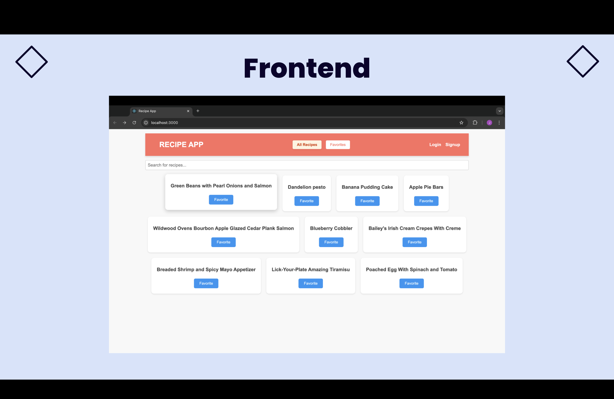
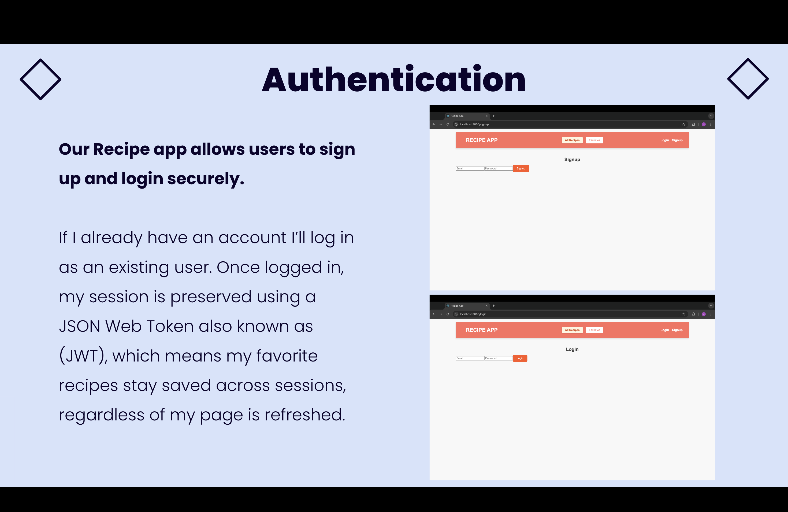
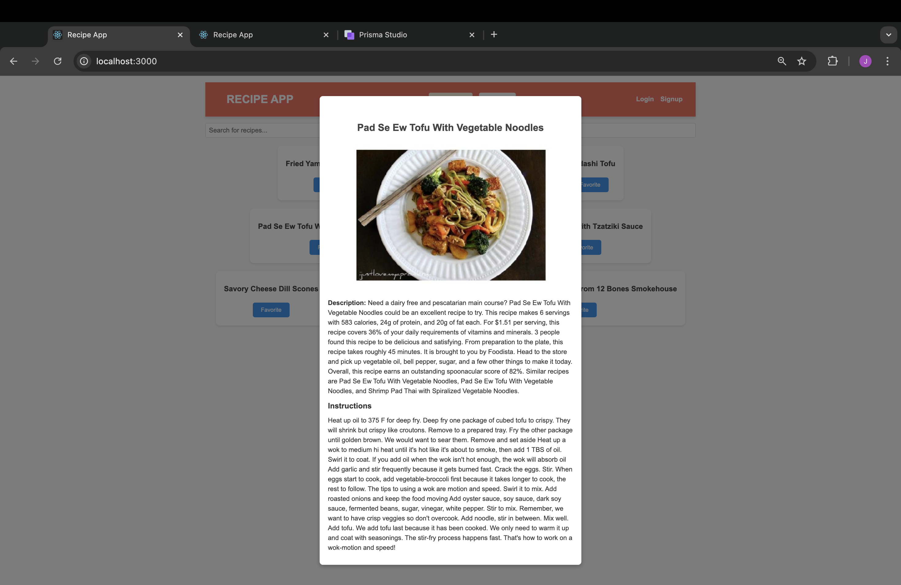
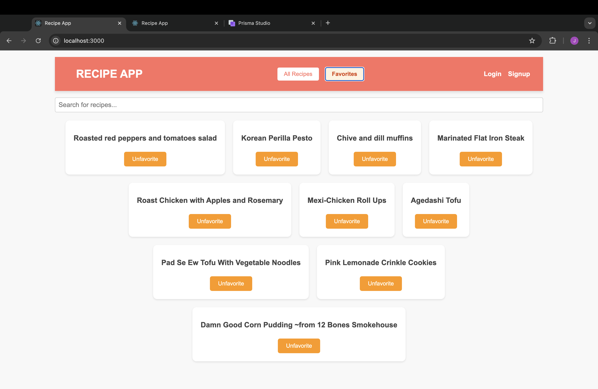

# Recipe App

## Description
Recipe App is a web application where users can explore different recipes and save their favorites. Users can sign up, log in, and personalize their experience by saving favorite recipes for future reference.

The app consists of a backend built with Node.js, Express, and Prisma, and a frontend developed using React. Recipe data is fetched from the Spoonacular API, and user information is securely stored using bcrypt for password hashing and JWT for user authentication.

## Features
- **User Signup/Login**: Create an account or log in to save favorite recipes.
- **Recipe Browsing**: Browse a variety of recipes, fetched from the Spoonacular API.
- **Favorites**: Mark recipes as favorite, which will be saved for easy access.
- **Local Storage Integration**: Save and access favorites using local storage for seamless experience.

## Tech Stack
- **Frontend**: React, Axios, CSS
- **Backend**: Node.js, Express, Prisma
- **Database**: SQLite with Prisma ORM
- **API**: Spoonacular Recipe API
- **Authentication**: JWT, bcrypt

## Setup and Installation
1. Clone the repository:
   ```
   git clone https://github.com/karickal1/recipe-app.git
   ```
2. Navigate into both frontend and backend directories:
   ```
   cd recipe-app-backend
   cd recipe-app-frontend
   ```
3. Install dependencies for both frontend and backend:
   ```
   npm install
   ```
4. Set up environment variables:
   - Create a `.env` file in the `recipe-app-backend` folder and add:
     ```
     JWT_SECRET=your_secret_key
     DATABASE_URL="file:./dev.db"
     ```
   - In `recipe-app-frontend`, add your Spoonacular API key in `.env`:
     ```
     REACT_APP_SPOONACULAR_API_KEY=your_api_key
     ```
5. Run the backend:
   ```
   npm start
   ```
6. Run the frontend:
   ```
   npm start
   ```

## Link to Presentation Video
[Watch the Presentation](https://youtu.be/zZzt95_bgm4)

## How to Use the Application
1. **Sign up or Log in** to access all features.
2. **Browse recipes** and click the "Favorite" button to save them.
3. Use the **Favorites** button in the navigation bar to access your saved recipes.

## Screenshots
### Homepage


### Signup/Login Page


### Recipe Page


### Favorites Page


## Authors
- Jonathan Karickal, Pooja Yadav, Jua Augustin, Meagan Leung
